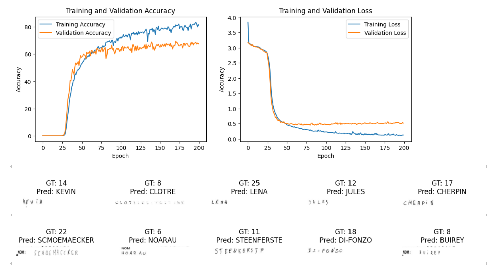
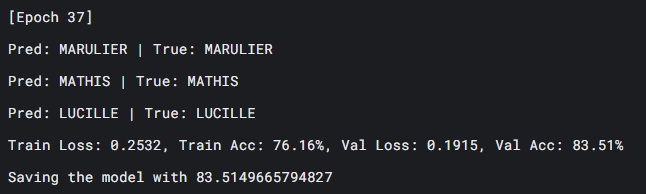

# Hand Writting with CRNN 

Using self-designed model with 2 Convolutional layers and 1 RNN layer (Gated Recurrent Unit). Total model parameters are about 586k

The loss function is CTC (Connectionist Temporal Classification)

1. Training with 5000 images train, 1000 images validation, 1500 images test (Accuracy: 65.1%)

2. Training with 330k images train, 41k images validation, 41k images test in Kaggle (Accuracy: 82.73%)

